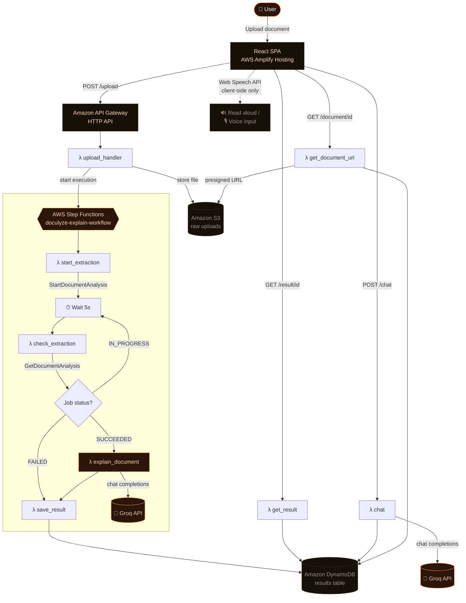

<div align="center">

# 📄 Doculyze

### Turn confusing documents into clear answers — spoken, too.

[](https://aws.amazon.com)
[](https://python.org)
[](https://react.dev)
[](https://vitejs.dev)
[](https://groq.com)

**Built for the First Commit hackathon — Bharat Builds Tour, Ship It track**

</div>

---

## Contents

- [The Problem](#-the-problem)
- [The Solution](#-the-solution)
- [Who It's For](#-who-its-for)
- [Architecture](#️-architecture)
- [AWS Services Used](#aws-services-used-and-what-each-one-is-doing)
- [Why Groq Instead of Amazon Bedrock](#️-why-groq-instead-of-amazon-bedrock)
- [Future Implementation](#-future-implementation)
- [Repo Layout](#-repo-layout)
- [Backend Functions](#backend-functions)
- [Frontend Features](#-frontend-features)
- [Prerequisites](#-prerequisites)
- [Deploy the Backend](#-deploy-the-backend)
- [Deploy the Frontend — AWS Amplify Hosting](#️-deploy-the-frontend--aws-amplify-hosting)
- [Local Testing Without AWS](#-local-testing-without-aws)
- [Running Backend Tests](#️-running-backend-tests)

---

## 🧩 The Problem

Everyone has a drawer — physical or digital — full of documents they
signed, skimmed, or filed away without really understanding: a rental
agreement, an electricity bill, a course syllabus, a job offer letter,
a terms-of-service page nobody reads. The language is dense, the
formatting is unhelpful, and the parts that actually matter — a
deadline, a penalty clause, an auto-renewal — are buried in the same
font as everything else.

Most people don't have a lawyer on call for a lease, or the patience
to read eleven pages of a syllabus to find the one line about late
submissions. That gap — between *having* a document and *understanding*
it — is what Doculyze closes.

## 💡 The Solution

**Doculyze is an agent that reads any document and explains it back to
you in plain language** — what it says, what matters, and what to
watch out for. Upload a PDF, a photo, or a scanned file and get:

- 📝 A **plain-language summary** of what the document actually says
- 🔑 **Key terms** pulled out — dates, numbers, obligations
- 🚩 **Flagged clauses** worth double-checking, highlighted at their
  exact position on the original document
- ✅ **Concrete next steps** — what to actually do about it
- 🔊 **Spoken aloud automatically**, and a **chat panel** — by text or
  by voice — to ask follow-up questions grounded in that document
- 📥 A clean **PDF export** of the whole explanation

There's no dropdown asking what kind of document you're uploading.
The same pipeline reads a one-page bill and a twenty-page lease
identically — the agent figures out what it is and adapts, rather than
the code assuming ahead of time.

## 👥 Who It's For

| | |
|---|---|
| 🏠 **Renters & tenants** | Understand lease terms, deposits, and notice periods before signing, or after something feels off |
| 🎓 **Students** | Turn a dense syllabus into a clear list of deadlines and grading rules |
| 🧾 **Consumers** | Make sense of bills, warranties, and terms of service without reading every line |
| 💼 **Employees** | Get a plain-language read on offer letters and benefits paperwork |
| 🌍 **Anyone, honestly** | Those are just the most common cases — the pipeline doesn't limit itself to a fixed list of document types |

## 🏗️ Architecture



*(GitHub, GitLab, and most modern Markdown viewers render this
diagram natively. If you're viewing this in plain text, the flow in
short: **Upload → S3 → Step Functions → Textract (async, polled) →
Groq → DynamoDB → back to the browser**, with chat and the document
viewer as two extra on-demand API calls off the results page.)*

Eight Lambda functions, one Step Functions state machine, one HTTP
API — a genuinely orchestrated pipeline, not a single function doing
everything.

### AWS services used, and what each one is doing

| Service | Role in Doculyze |
|---|---|
| 🪣 **Amazon S3** | Stores every uploaded document. Also the source the presigned document-viewer URLs point at. |
| 🧠 **Amazon Textract** | Reads the document — text, tables, key/value pairs, and the exact on-page position of every line. Called *asynchronously* (`StartDocumentAnalysis` / `GetDocumentAnalysis`), not the synchronous API, specifically so a single-page bill and a twenty-page lease go through the identical code path with no special-casing. |
| ⚙️ **AWS Step Functions** | Orchestrates the whole pipeline as a visible, debuggable state machine — extraction, the poll loop, explanation, and saving the result — with per-stage retries instead of retrying an entire monolithic function on any failure. |
| λ **AWS Lambda** | Every unit of compute in the backend — eight functions total, each doing one job. Nothing runs, and nothing costs anything, when no one is uploading a document. |
| 🗄️ **Amazon DynamoDB** | Stores each analysis result — status, summary, flagged clauses, raw extracted text (for chat), and the document's S3 location (for the viewer) — on-demand billing, no provisioned capacity to manage. |
| 🌐 **Amazon API Gateway** | A single HTTP API fronting all six externally-callable Lambda functions, with CORS handled at the gateway level. |
| ☁️ **AWS Amplify Hosting** | Hosts the React frontend — a static single-page build, no server to manage. Deploy steps below. |
| 📊 **AWS X-Ray** (via `Tracing: Active`) | Every Lambda function traces its execution, so a slow or failing step is traceable end-to-end across the whole pipeline, not just visible in isolated logs. |

That's **eight distinct AWS services** working together in one
pipeline — not one Lambda calling one API. The one deliberate
exception is explained below.

## ⚠️ Why Groq Instead of Amazon Bedrock

The explanation step originally called **Amazon Bedrock**, and it
worked. It was ultimately swapped for **Groq** for reasons worth being
upfront about, since it's the one place this project steps outside
AWS:

- **Model access friction.** Bedrock requires explicitly requesting
  and being granted access to each individual foundation model, per
  AWS account, per region, before a single API call succeeds. On a
  fresh or restricted account — exactly the kind of account you're
  often working with mid-hackathon — that approval step can introduce
  real delay at the worst possible time.
- **Regional availability gaps.** Not every Bedrock model is available
  in every AWS region, which can quietly force a redeploy into a
  different region depending on which model you want.
- **Inference speed.** Groq's LPU hardware is built specifically for
  fast token generation. For a live, interactive feature like chat —
  where a visible delay breaks the conversational feel — that speed
  difference is noticeable, not theoretical.
- **Iteration speed during a hackathon.** A free-tier Groq API key
  works immediately, with none of the account-level approval steps
  above, which matters when the clock is running.

We also initially tried reaching Groq **through** the Strands Agents
SDK rather than calling it directly, for its agent-framework
structure. That introduced its own problems — `strands-agents` has a
hard dependency on `mcp` (Model Context Protocol support this app
never uses), which in turn requires `pywin32` on Windows, breaking
`sam build` on a native Windows machine over a dependency completely
unrelated to what we needed Strands for. On top of that, its installed
size (~130MB, or ~314MB through the more commonly documented LiteLLM
path — over Lambda's 250MB unzipped limit outright) added real
cold-start and build-time cost for agentic features — tool use,
multi-step reasoning, MCP — this app never exercises.

**The honest scorecard:** `explain_document` and `chat` now call
Groq's chat completions API directly over HTTPS with Python's built-in
`urllib` — zero extra dependencies, builds identically on any OS, and
the deployment package is back to the same lean size it had with
Bedrock. Every other service in the architecture table above is still
genuinely AWS. If "Built on AWS" is weighted specifically on the model
host, that's the one honest trade-off here — made for reasons of
access friction and live-demo latency, not because Bedrock doesn't
work.

One more thing worth knowing: Groq moved `llama-3.3-70b-versatile` and
`llama-3.1-8b-instant` to its Enterprise-only tier on 2026-08-16 —
they no longer work with a free/developer key. Doculyze defaults to
`openai/gpt-oss-120b`, Groq's own recommended replacement — see
[console.groq.com/docs/models](https://console.groq.com/docs/models)
for the current list before overriding it.

## 🚀 Future Implementation

Things worth building next, roughly in order of impact:

- **AWS Secrets Manager** for `GROQ_API_KEY` instead of a plain Lambda
  environment variable — the current setup is fine for a hackathon,
  not for production.
- **Amazon Cognito** for user accounts, so each person's document
  history is private and persistent instead of anonymous per-session.
- **Amazon Polly** as a higher-quality alternative to the browser's
  built-in Web Speech API for narration.
- **Amazon Transcribe** for voice input that works in every browser,
  not just Chromium-based ones (the current mic button uses the
  browser's native `SpeechRecognition`, which Firefox and Safari don't
  support).
- **Multi-language support** — explain a document in a language other
  than the one it's written in.
- **Batch upload** — analyze several documents in one pass (useful for
  a full lease packet, or a semester's worth of syllabi at once).
- **CloudFront + WAF** in front of the API for production-grade
  caching and abuse protection.
- **CI/CD** via GitHub Actions or AWS CodePipeline, so `sam deploy`
  isn't a manual step.

## 📁 Repo Layout

```
doculyze/
├── infra/         SAM template + Step Functions definition (deploy target)
├── backend/        Lambda functions (Python)
├── frontend/       React + Vite single-page app (glassmorphism UI)
├── docs/           architecture notes, demo script, sample documents
└── scripts/        deploy + seed helpers
```

📹 **Presenting or recording a demo?** See
[`docs/demo-script.md`](docs/demo-script.md) for a paced, 3-minute
walkthrough covering the upload flow, the spoken explanation, the
highlighted clauses, voice chat, and the architecture.

### Backend functions

| Function | Trigger | Does |
|---|---|---|
| `upload_handler` | `POST /upload` | Stores the file in S3, starts the Step Functions execution |
| `start_extraction` | Step Functions | Starts an async Textract job (`StartDocumentAnalysis`) |
| `check_extraction` | Step Functions (polled) | Checks job status; once done, pages through *all* Textract result batches via `NextToken` and extracts text, key/value pairs, and each line's position on the page |
| `explain_document` | Step Functions | Sends extracted text directly to Groq's chat completions API, parses the structured explanation, and locates each flagged clause's exact quote against the extracted lines to attach a highlight position |
| `save_result` | Step Functions | Writes the final result (or failure) to DynamoDB, including the raw text and S3 location needed by the two functions below |
| `get_result` | `GET /result/{id}`, `GET /results` | Serves results to the frontend |
| `chat` | `POST /chat` | Answers follow-up questions about an already-analyzed document via a direct Groq call seeded with the prior conversation, grounded in the document's stored text |
| `get_document_url` | `GET /document/{id}` | Returns a short-lived presigned S3 URL for the original file, so the frontend can render it with highlight overlays |

## ✨ Frontend Features

Beyond upload → explain, the results view includes:

- **Document preview with highlights** — the original file (image or multi-page PDF, rendered client-side with `pdfjs-dist`) shown with each flagged clause highlighted at its actual position on the page. A flag whose exact wording couldn't be matched back to a position is still listed in text — it just won't have a highlight, rather than failing anything.
- **Spoken explanation** — as soon as an explanation is ready, the browser reads it aloud automatically, with a Listen/Stop control in case autoplay is blocked or you want to replay it.
- **Chat, by text or by voice** — ask follow-up questions about the document; a microphone button lets you ask by speaking instead of typing (Chrome/Edge only — the button simply doesn't render in browsers without voice-input support), and each answer has its own "read aloud" toggle. Answers are grounded only in that document's extracted text.
- **Download as PDF** — a clean, text-based PDF of the explanation (not a screenshot), generated client-side with `jspdf`.

Voice features use the browser's built-in Web Speech API — no backend, no new AWS service, no extra bundle weight, and every call is feature-detected so unsupported browsers just don't show the button rather than showing a broken one. Both `pdfjs-dist` and `jspdf` are loaded via dynamic `import()` only when actually needed (viewing a PDF, or clicking download), so neither adds weight to the initial page load.

## ✅ Prerequisites

- A [Groq API key](https://console.groq.com/keys) (free tier available)
- AWS CLI configured (`aws configure`)
- [AWS SAM CLI](https://docs.aws.amazon.com/serverless-application-model/latest/developerguide/install-sam-cli.html)
- Node.js 18+ (frontend)
- Python 3.12 (backend)
- A GitHub (or GitLab/Bitbucket) repo, if deploying the frontend through Amplify's Git-based workflow (recommended — see below)

## 🔧 Deploy the Backend

```bash
cd infra
sam build
sam deploy --guided --parameter-overrides GroqApiKey=gsk_your_key_here
```

`GroqApiKey` is marked `NoEcho` in the template so it won't show up in
CloudFormation console output, but it's still set as a plain Lambda
environment variable — fine for a hackathon, not for production (see
Future Implementation above). This provisions: S3 bucket, DynamoDB
table, Lambda functions, Step Functions state machine, and an API
Gateway HTTP API. Note the API endpoint URL printed at the end of
`sam deploy` — you'll need it for the frontend.

The default model, `openai/gpt-oss-120b`, is Groq's own current
recommendation — double-check
[console.groq.com/docs/models](https://console.groq.com/docs/models)
before overriding `GroqModelId` to something else. To use a different
model, add `GroqModelId=<model-id>` to the same `--parameter-overrides`
flag.

## ☁️ Deploy the Frontend — AWS Amplify Hosting

The frontend is a static Vite/React build with no server-side
rendering, which is exactly what Amplify Hosting is built for. It
already ships with `frontend/amplify.yml`, so Amplify auto-detects the
build settings — no manual configuration needed beyond the API URL.

**Option A — Git-connected deploy (recommended)**

1. Push this repo to GitHub, GitLab, or Bitbucket.
2. In the [AWS Amplify Console](https://console.aws.amazon.com/amplify/), choose **Host a web app** → connect your repository → select the branch to deploy.
3. When Amplify asks for the app root, set it to `frontend/` (this is a monorepo — the frontend isn't at the repo root).
4. Amplify reads `frontend/amplify.yml` automatically:
   ```yaml
   version: 1
   frontend:
     phases:
       preBuild:
         commands:
           - npm ci
       build:
         commands:
           - npm run build
     artifacts:
       baseDirectory: dist
       files:
         - '**/*'
     cache:
       paths:
         - node_modules/**/*
   ```
5. Before the first build, add an environment variable in **App settings → Environment variables**:
   ```
   VITE_API_BASE_URL = https://your-api-id.execute-api.your-region.amazonaws.com
   ```
   (the exact value printed at the end of `sam deploy` above)
6. Click **Save and deploy**. Amplify builds and hosts it on a
   `https://<branch>.<app-id>.amplifyapp.com` URL, with HTTPS and a
   CDN in front of it by default.

**Option B — Manual deploy (no Git required)**

```bash
cd frontend
npm install
cp .env.example .env
# edit .env — paste in the ApiEndpoint from the backend deploy output
npm run build
```

Then in the Amplify Console, choose **Host a web app** → **Deploy
without Git provider** → drag and drop the `frontend/dist/` folder.

Either way, because the app is single-page with no client-side
routing, **no rewrite rules are needed** — a common Amplify + SPA
gotcha this project simply doesn't hit.

## 🧪 Local Testing Without AWS

`scripts/seed_test_data.sh` uploads a couple of sample documents from
`docs/sample-documents/` straight to the S3 bucket so you can watch the
pipeline run end-to-end without using the UI.

## ✔️ Running Backend Tests

```bash
cd backend
pip install boto3 pytest --break-system-packages
python3 -m pytest tests/ -v
```

Should show **33 passing**. The tests never call the real Groq API —
each test monkeypatches the function's own `_call_groq` with a fake,
so no `GROQ_API_KEY` is needed to run them (a dummy value is set in
`tests/conftest.py`).

---

<div align="center">

Built with 🧠 for the **First Commit** hackathon — Bharat Builds Tour

</div>
